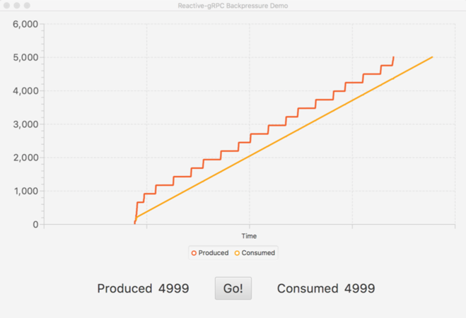
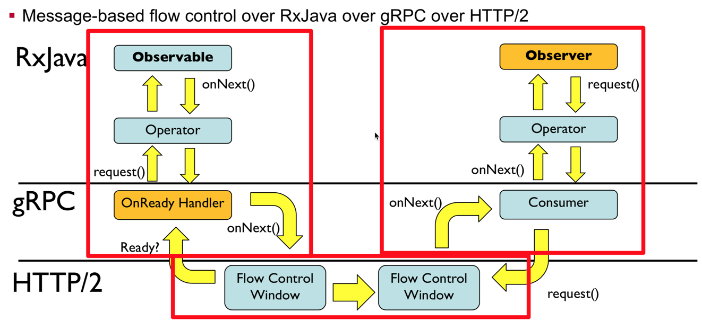

# What is reactive-grpc?
Reactive gRPC is a suite of libraries for using gRPC with [Reactive Streams](http://www.reactive-streams.org/) programming libraries. Using a protocol buffers
compiler plugin, Reactive gRPC generates alternative gRPC bindings for each reactive technology.
The reactive bindings support unary and streaming operations in both directions. Reactive gRPC also builds on top of gRPC's
back-pressure support, to deliver end-to-end back-pressure-based flow control in line with Reactive Streams
back-pressure model.

Reactive gRPC supports the following reactive programming models:

* [RxJava 2](https://github.com/salesforce/reactive-grpc/tree/master/rx-java)
* [Spring Reactor](https://github.com/salesforce/reactive-grpc/tree/master/reactor)

[Akka gRPC](https://github.com/akka/akka-grpc) is now mature and production ready. Use that for Akka-based services.

# Usage
See the readme in each technology-specific sub-directory for usage details.

* [Rx-Java](https://github.com/salesforce/reactive-grpc/tree/master/rx-java)
* [Spring Reactor](https://github.com/salesforce/reactive-grpc/tree/master/reactor)

# Demos

* Lots of demos in the [demos directory](https://github.com/salesforce/reactive-grpc/tree/master/demos)

# Android support
Reactive gRPC supports Android to the same level of the underlying reactive technologies.

* Rx-Java - Generated code targets Java 8, so it _should_ work with Android.
* Spring Reactor - [Not officially supported.](http://projectreactor.io/docs/core/release/reference/docs/index.html#prerequisites) 
  "Reactor 3 does not officially support or target Android, however, it should work fine with Android SDK 26 (Android O) and above."

# Back-pressure
Reactive gRPC stubs support bi-directional streaming with back-pressure. Under the hood, Reactive gRPC is built atop the vanilla
gRPC service stubs generated by protoc. As such, they inherit gRPC's HTTP/2-based back-pressure model.

Internally, gRPC and Reactive gRPC implement a pull-based back-pressure strategy. At the HTTP/2 layer, gRPC maintains a
buffer of serialized protocol buffer messages. As frames are consumed on the consumer side, the producer is signaled
to transmit more frames. If this producer-side transmit buffer fills, the HTTP/2 layer signals to the gRPC messaging
layer to stop producing new messages in the stream. Reactive gRPC handles this signal, applying back-pressure to Reactive Streams
using the `Publisher` api. Reactive gRPC also implements `Publisher` back-pressure on the consumer side of a stream. As messages
are consumed by the consumer-side `Publisher`, signals are sent down through gRPC and HTTP/2 to request more data.

An example of back-pressure in action can be found in [BackpressureIntegrationTest.java](https://github.com/salesforce/reactive-grpc/blob/master/rx-java/rxgrpc-test/src/test/java/com/salesforce/rxgrpc/BackpressureIntegrationTest.java).

### Understanding Reactive gRPC Flow Control
For simple unary request and response services, Reactive gRPC's flow control model is transparent. However, Reactive 
gRPC is built on top of three different interacting flow control models, and, as a result, backpressure doesn't always 
behave exactly as you would expect. For streaming services, flow control isn't always intuitive, especially when 
infinite streams are involved.

* At the bottom is the [HTTP/2's byte-based flow control](https://developers.google.com/web/fundamentals/performance/http2/#flow_control). 
  HTTP/2 works on streams of bytes and is completely unaware of gRPC messages or reactive streams. By default, the 
  stream consumer allocates a budget of 65536 bytes. The stream producer can send up to this many bytes before 
  backpressure engages. As the consumer reads bytes, `WINDOW_UPDATE` messages are sent to the producer to increase its 
  send budget.

* In the middle is the [gRPC-Java message-based flow control](https://github.com/grpc/grpc-java/tree/master/examples/src/main/java/io/grpc/examples/manualflowcontrol). 
  gRPC's flow control adapts the stream-based flow control of HTTP/2 to a message-based flow control model. Importantly, 
  gRPC's flow control is aware of how it interacts with HTTP/2 and the network.

  On producing side, an on-ready handler reads a message, serializes it into bytes using protobuf, and then queues it up 
  for transmission over the HTTP/2 byte stream. If there is insuficient room in the HTTP/2 flow control window to 
  transmit, backpressure engages an no more messages are requested from the producer until space becomes available.

  On the consuming side, each time a consumer calls `request(x)`, gRPC attempts to read and deserialize `x` messages 
  from the HTTP/2 stream. Since the size of a protobuf encoded message is variable, there is not a one-to-one 
  correlation between pulling messages from gRPC and pulling bytes over HTTP/2.
  
* At the top is the [Reactive Streams message-based flow control](https://github.com/reactive-streams/reactive-streams-jvm/blob/v1.0.2/README.md). 
  Reactive Streams' flow control is designed for producing and consuming messages from end to end. Since the producer 
  and consumer are in the same address space, when the consumer calls `request(x)`, the producer creates a message and 
  calls `onNext()` `x` times. Reactive Streams flow control assumes all the parts of the chain are linked by method 
  calls. Inserting gRPC and HTTP/2 in the middle of a reactive stream is a bending of the protocol.

When reasoning about flow control with Reactive gRPC, you cannot assume everything works like Reactive Streams. A call to `request(1)` on the consuming side of the wire will not necessarially result in a `request(1)` call on the producing side. Zero or more messages may be requested from the producer based on the state of the HTTP/2 flow control window, and the serialized size of each protobuf message. Instead, you need to think about how each stage in processing interacts with the stage before and after it.

`Reactive` ➜ `gRPC` ➜ `HTTP/2` ➜ `...` ➜ `HTTP/2` ➜ `gRPC` ➜ `Reactive`

# Exception Handling
Exception handling with Reactive gRPC is a little strange due to the way gRPC deals with errors. Servers that produce an error
by calling `onError(Throwable)` will terminate the call with a `StatusRuntimeException`. The client will have its
`onError(Throwable)` subscription handler called as expected.

Exceptions going from client to server are a little less predictable. Depending on the timing, gRPC may cancel
the request before sending any messages due to an exception in the outbound stream.

# Contributing
Found a bug? Think you've got an awesome feature you want to add?  We welcome contributions!

## Submitting a Contribution
1. Search for an existing issue.  If none exists, create a new issue so that other contributors can keep track of what 
   you are trying to add/fix and offer suggestions (or let you know if there is already an effort in progress).  Be sure 
   to clearly state the problem you are trying to solve and an explanation of why you want to use the strategy you're 
   proposing to solve it.
1. Fork this repository on GitHub and create a branch for your feature.
1. Clone your fork and branch to your local machine.
1. Commit changes to your branch.
1. Push your work up to GitHub.
1. Submit a pull request so that we can review your changes.

*Make sure that you rebase your branch off of master before opening a new pull request. We might also ask you to rebase 
it if master changes after you open your pull request.*

## Acceptance Criteria
We love contributions, but it's important that your pull request adhere to the standards that we maintain in this repository.

- All tests must be passing
- All code changes require tests
- All code changes must be consistent with our Checkstyle rules.  We use the [Google Java Style Guide](https://google.github.io/styleguide/javaguide.html) with a few small alterations.
- Code should have great inline comments
